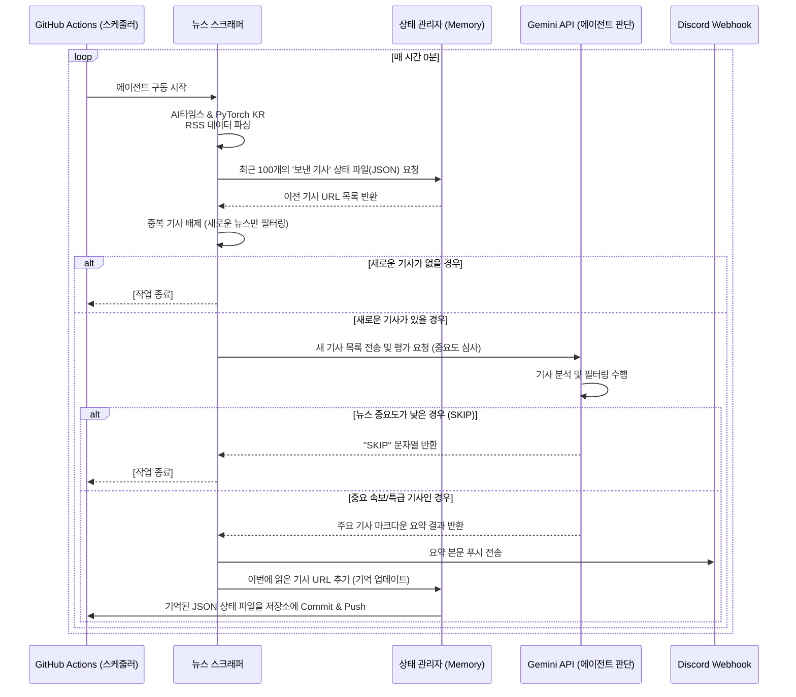

# AI News Agent Pipeline

매 시간마다 'AI타임스'와 'PyTorch KR' 뉴스를 모니터링하고, LLM(Google Gemini)을 통해 핵심 뉴스만 선별하여 마크다운 형태로 직관적으로 요약한 뒤 지정된 디스코드 채널로 전송하는 **스마트 뉴스 에이전트 봇**입니다.

## 🏗️ 시스템 아키텍처 (Architecture Flow)

현재 에이전트는 **단기 기억 모듈**과 **LLM 중요점수 필터링**이 결합된 1시간 단위 스케줄러를 기반으로 동작합니다.



## 🚀 로컬 환경 구동 방법 (테스트 목적)
1. Python 환경에서 패키지를 설치합니다: `pip install -r requirements.txt`
2. `.env` 파일을 프로젝트 루트에 생성하고 아래 환경변수를 입력합니다.
   ```
   GEMINI_API_KEY=당신의_구글_제미나이_API_키
   DISCORD_WEBHOOK_URL=웹훅주소1,웹훅주소2
   ```
3. `python main.py`를 실행하여 로컬 환경에서 메시지 전송 및 필터링 로직을 테스트해 봅니다.

## ⚙️ GitHub 자동화 환경 설정 방법
1. 빈 GitHub Repository를 Private로 생성합니다.
2. 현재 폴더의 내용물을 생성한 GitHub Repository에 커밋하고 푸시합니다.
3. GitHub Repository 페이지 상단의 `Settings` 탭으로 이동합니다.
4. 왼쪽 메뉴에서 `Secrets and variables` -> `Actions` 를 클릭합니다.
5. **[New repository secret]** 버튼을 눌러 다음 2개의 Secret을 등록합니다.
   - Name: `GEMINI_API_KEY` / Value: `(당신의 API Key)`
   - Name: `DISCORD_WEBHOOK_URL` / Value: `(디스코드 웹훅 주소)`
6. `.github/workflows/daily_summary.yml` 코드가 이미 포함되어 있으며, 리포지토리 설정에서 `Actions`의 읽기/쓰기 권한(Read and write permissions)이 켜져 있어야 상태 저장(Commit)이 가능합니다.
7. 액션이 켜지면 매 정각마다 코드가 동작하며 새 뉴스를 디스코드로 전송합니다. 수동 실행은 `Actions` 탭의 `Run workflow` 버튼을 이용합니다.
